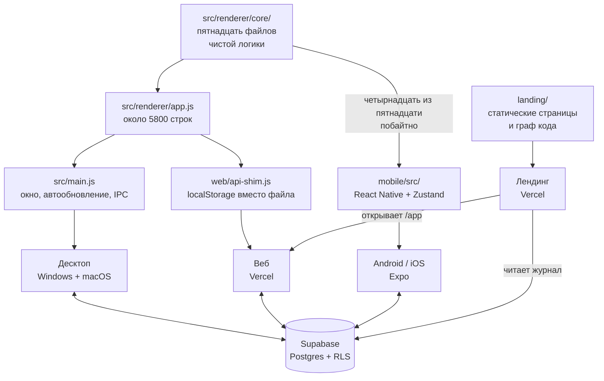
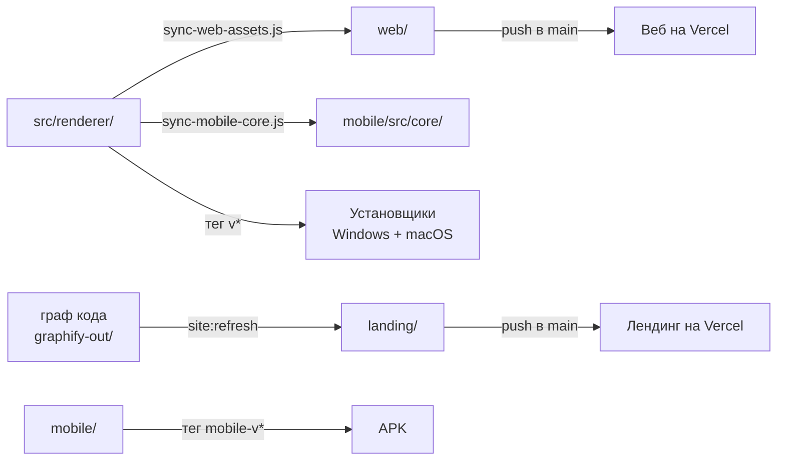

# Как устроен Lancible

Одна модель данных на четыре поверхности: десктоп, веб, телефон и лендинг.
Документ описывает, что где лежит, что между поверхностями общее, а что
продублировано — и чем за это приходится платить. Последний раздел — список
того, что нужно сделать; он часть этого файла намеренно, потому что каждый
пункт там вытекает из устройства, описанного выше.

Числа в документе — замеры на 4 октября 2026 года, а не оценки на глаз.
Длина функции считается по балансу фигурных скобок, а не «от объявления до
следующего объявления»: второй способ приписывает функции все комментарии и
код между ними и завышает всё вдвое. Так уже вышло однажды — fmtWhen значился
здесь как 48 строк, хотя их пять.

То же самое с картинками опубликовано на `lancible.vercel.app/architecture`
(`landing/architecture.html`). Страница служебная: ссылок на неё с сайта нет,
от поисковиков она закрыта, открыть по адресу может кто угодно — ровно как
журнал работы. Числа там те же, что здесь, и разойтись им не дают два
механизма. Редкие — сколько файлов в ядре и сколько из них у телефона —
сторожит `tests/unit/architecture.test.js`: добавил файл в ядро и не поправил
страницу или этот документ — коммит не пройдёт. Частые — строки и функции
`app.js` — пересчитывает `npm run site:refresh` перед выкатом.

Где у каждой поверхности лежат цвета, шрифты, общие детали и стили экранов —
отдельная карта, `DESIGN.md`.

Рядом, на `lancible.vercel.app/graph`, — граф кода от graphify, закрытый так
же. Он тоже обновляется командой `npm run site:refresh` (см. «Сборка и
выкат»).

## Четыре поверхности



Десктоп и веб делят **один и тот же** `app.js`: у браузера есть DOM, и код
переиспользован почти буквально. Отличает их только шим — третья реализация
контракта `window.api`. Телефон делит с ними лишь часть ядра: DOM там нет,
и обёртку пришлось писать заново.

## Данные

Состояние плоское, живёт целиком в памяти и сохраняется одним куском.

```js
{
  projects: [], tasks: [], statuses: [], tags: [], versions: [],
  activeTimer: null,
  ui:       { view, projectId, navCollapsed },
  settings: { hourlyRate, currency, theme, lang, syncEnabled, syncResolvedFor },
}
```

Кому что принадлежит — не мелочь, на этом уже обжигались:

| Сущность    | Чья                  | Почему так                                             |
|-------------|----------------------|--------------------------------------------------------|
| `projects`  | пользователя         | —                                                       |
| `tasks`     | проекта              | у задачи всегда есть `projectId`                        |
| `statuses`  | **проекта**          | раньше были общими; миграция развела их по проектам     |
| `versions`  | **проекта**          | версия принадлежит продукту, а не всему аккаунту        |
| `tags`      | **общие**            | заводятся в настройках и видны везде                    |
| `sessions`  | задачи               | отрезок времени со своей ставкой на момент записи       |

Ставка запоминается в самой записи времени, а не берётся из текущих настроек:
иначе смена ставки задним числом переписала бы весь заработок за историю.

### В базе

Шесть таблиц в `supabase/schema.sql`: `profiles`, `projects`, `tasks`,
`sessions`, `user_settings`, `sync_state`. Своего сервера у проекта нет, ключ
`anon` открыт, и от чужих данных отделяют только политики RLS — по одной на
таблицу, все вида «own ...». Поэтому права доступа закрыты отдельным слоем
тестов, см. ниже.

Журнал работы (`logs.sql`) лежит там же, но отдельно: писать в него может
только служебный ключ, а читать — кто угодно, иначе страница `/logs` на
лендинге ничего бы не показала.

## Общее ядро и где оно кончается

В `src/renderer/core/` пятнадцать файлов чистой логики без единого
обращения к DOM. На телефон `scripts/sync-mobile-core.js` копирует
**четырнадцать** из них побайтно, а `tests/unit/mobile-core.test.js` следит,
чтобы копии не разошлись с оригиналом.

Своим у телефона остался один — словарь. Вот что где:

| Область    | Десктоп и веб            | Телефон                      | Сверяется тестом |
|------------|--------------------------|------------------------------|------------------|
| `agenda`   | `core/agenda.js`         | побайтная копия              | да               |
| `repeat`   | `core/repeat.js`         | побайтная копия              | да               |
| `status`   | `core/status.js`         | побайтная копия              | да               |
| `versions` | `core/versions.js`       | побайтная копия              | да               |
| `money`    | `core/money.js`          | побайтная копия              | да               |
| `format`   | `core/format.js`         | побайтная копия + локали     | да               |
| `tags`     | `core/tags.js`           | побайтная копия + свои цвета | да               |
| `sync`     | `core/sync.js`           | побайтная копия              | да               |
| `due`      | `core/due.js`            | побайтная копия + язык       | да               |
| отчёты     | `core/reports.js`        | побайтная копия + обёртка    | да               |
| `lang`     | `core/lang.js`           | побайтная копия              | да               |
| `catalog`  | `core/catalog.js`        | побайтная копия              | да               |
| `views`    | `core/views.js`          | побайтная копия + сборка RN  | да               |
| `migrate`  | `core/migrate.js`        | побайтная копия + свои поля интерфейса | да     |
| `i18n`     | `core/i18n.js`           | свой словарь, строки короче  | частично         |

Словарь остаётся своим по делу: у телефона свои экраны и строки короче.
Сверяют его тесты — что взятое у десктопа взято дословно.

Миграция своей была до недавнего времени, и две реализации успели
разойтись в обе стороны. Телефон чинил время задачи (`sessions`,
`totalMs`), а десктоп нет — задача с `sessions: null` роняла бы десктоп на
первом же подсчёте. Десктоп чинил статусы неизвестного вида, нумеровал
версии подряд, выбрасывал мусор вместо правила повторения и выводил
«отменена» из статуса — телефон ничего этого не делал. Теперь правила
одни, в `core/migrate.js`, и взяты из обеих сторон. Своими у платформ
остались только поля интерфейса — у десктопа свёрнутая панель, у телефона
положение доски и подсказка про свайп; ядро даёт для них крючок `deps.ui` и
список живых проектов.

Палитра, валюты и ключ имени проекта по умолчанию лежали в двух
экземплярах слово в слово и тоже ушли в ядро — `core/catalog.js`. Это
свойства продукта, а не платформы.

Со словарём разделение прошло по шву «данные против правил». Сами словари
у платформ разные и останутся разными: у десктопа 416 ключей, у телефона
314, общих из них 268 — экраны разные, и возить на телефон полторы сотни
чужих строк незачем. А машинка — `translate` и `pluralForm` — была
одинаковой слово в слово, вплоть до комментария про общее славянское
правило, и уехала в `core/lang.js`. Там же карта локалей и названия языков.

Что словарям разрешено различаться, стоило отдельной проверки. Они и
разошлись — не в длине, а в словах: один и тот же дедлайн назывался
«сроком» на десктопе и «дедлайном» на телефоне, а обращение было то на «вы»,
то на «ты». Выбрано «дедлайн» и «вы», и выбор закреплён
`tests/unit/wording.test.js`: словами в документе такое не удержится.

Остальное телефон берёт из побайтных копий, а сверху кладёт тонкий слой:
подставить язык, локаль и «сейчас» там, где ядро принимает их параметром.
`tests/unit/mobile-parity.test.js` проверяет не «работает так же», а «это
те же самые функции» — сравнивает объекты. Проверка поведения пропустила бы
заново написанную копию.

Там же стоит сторож на разрастание: если у телефона появится функция с
именем из ядра, которой нет ни в списке взятых, ни в списке обёрток, тест
упадёт. Иначе новая копия завелась бы молча — именно так и вышло с
отчётами.

Отдельный случай — выгрузка в Excel. Генератор `.xlsx` (`src/xlsx.js`)
переписан на `Uint8Array`/`DataView` без `Buffer` и `zlib`, поэтому работает
и в браузере, и под Hermes без единой правки — его телефон берёт как есть.
Построители листов до недавнего времени существовали дважды и успели
разойтись; теперь их форма — строки, колонки, формулы и итоги — лежит в
`core/reports.js`, а подписи и форматирование приходят параметрами через
`makeReports()`, потому что словарь и `format` у платформ всё ещё свои.
Это и есть образец, по которому стоит закрывать остальные строки таблицы:
общее — в ядро, различия — параметром.

## Сборка и выкат



| Что          | Чем запускается      | Когда                            |
|--------------|----------------------|----------------------------------|
| Веб          | push в `main`        | автоматически                     |
| Лендинг      | push в `main`        | автоматически                     |
| Установщики  | тег `v*`             | GitHub Actions, macOS-раннер обязателен |
| APK          | тег `mobile-v*`      | GitHub Actions                    |

Отсюда правило из `CLAUDE.md`: пуш в `main` — это выкат, поэтому без прямой
команды он не делается.

Перед пушем — `npm run site:refresh`. Он пересобирает граф кода, проверяет
его на секреты (ключи, токены, адреса почты — при любой находке публикация
останавливается), кладёт на лендинг как `landing/graph-view.html` и
пересчитывает числа на `/graph` и `/architecture`. Делать это на каждом
коммите незачем: граф весит почти два мегабайта, а сайт всё равно
обновляется только выкатом — значит, и показывать он должен код на момент
выката.

`web/index.html` написан руками, а стили тянет общие с десктопом. Сборка
копирует в `web/` только `app.js`, `styles.css`, `xlsx.js`, файлы `core/` и
шрифты — разметку не трогает. Поэтому после правки `src/renderer/index.html`
её нужно переносить в `web/index.html` следом, и об этом легко забыть.

## Проверка

Пять слоёв, у каждого своя работа.

| Слой       | Что проверяет                       | Чем                     |
|------------|-------------------------------------|-------------------------|
| `tests/unit/`    | чистую логику из `core/` и правила, видные в исходниках | тест-раннер Node, доли секунды |
| `mobile/tests/`  | экраны и стор телефона        | jest-expo + testing-library |
| `tests/e2e/`     | собранный `web/` в браузере, включая замеры вёрстки | Playwright |
| `tests/landing/` | отрисованные шапку и подвал лендинга на четырёх ширинах; что граф на `/graph` рисуется, а подписи схемы на `/architecture` не наезжают друг на друга | Playwright |
| `tests/visual/`  | снимки с эталоном             | Playwright; нет эталона для этой системы — пропуск с причиной |
| `tests/backend/` | политики доступа к базе       | заведомо нарушающая внешний ключ строка: `42501` — политика сработала, `23503` — пропустила |

Гоняются сами, на трёх дистанциях: `npm run watch` поднимает задетые слои,
пока идёт работа; крюк перед коммитом обновляет граф и гоняет быстрые;
GitHub на каждый push и pull request — всё целиком, четырьмя параллельными
работами. Известные недоработки помечены `{ todo: ... }` и
`test.fail(...)`: такой тест виден в отчёте, но не красит сборку.

В `tests/unit/` лежат не только расчёты. Туда же переехали правила, которые
раньше держались на внимании: системных `<select>` в проекте нет, все
модалки центруются одним правилом, шапка и подвал лендинга одинаковы на всех
его страницах, служебные адреса закрыты от поисковиков. Всё это читается из
исходников, то есть проверяется за доли секунды и успевает в крюк.

Сверх этого есть граф кода: `graphify-out/` строится локально командой
`graphify update .` и в git не попадает (3,9 МБ производных данных). Он даёт
`graphify query`, `path`, `explain` и две картинки — `graph.html` и
`GRAPH_TREE.html`. Первая выкладывается на `lancible.vercel.app/graph` — тем
же `npm run site:refresh` перед выкатом.

## Что необходимо сделать

По убыванию отношения «польза к риску». Числа — замеры, а не ощущения.

Как меряется. Длина функции — по балансу фигурных скобок от объявления до
закрывающей, со строками и комментариями вычеркнутыми; мера «от объявления до
следующего объявления» врёт на всём, между чем лежат комментарии, и однажды
уже наврала: `fmtWhen` был объявлен как 48 строк при настоящих пяти.
«Чистая» — не то же, что «не трогает DOM»: сеть, хранилище, тосты и `state`
DOM тоже не трогают, а в ядре им места нет. Прошлый замер считал иначе, так
что вычитать те числа из этих нельзя.

### Список работ закрыт

Последний пункт — разделить отрисовку — сделан. Что осталось в `app.js`, это
сборка DOM, и тяжёлой её больше не назовёшь.

Замер: 5829 строк, из них 530 пустых и 698 комментариев. Функций верхнего
уровня 305; по-настоящему чистых — 83 на 371 строку, и самая длинная из них
15 строк. Самые длинные с DOM — диалоги и выпадающие списки:
`renderCalendar` (70), `renderVersionDialog` (69), `renderSearch` (67),
`openTagPicker` (66), `renderStatusDialog` (62). Это почти целиком
`createElement` и обработчики, решений в них немного. Резать их стоит, когда
их всё равно правишь, — тем же приёмом, что описан ниже.

**Приём.** Отрисовка смешивала два дела: решить, что показать, и собрать из
этого DOM. Решения — какие значки, какой текст, что подсветить — ушли в
`core/views.js` и закрыты тестами; в `app.js` осталась сборка. Для вида,
который есть и у телефона, правило общее: строку задачи телефон рисует тем
же `taskRowView`, что и десктоп. Безопасность правки держат снимки с
эталоном, снятые до неё: после неё все четырнадцать снимков веба совпали с
эталонами байт в байт.

Отдельно про `cellsForScope` (22 строки): прошлый замер записал её в чистые
кандидаты, и это ошибка меры «не трогает DOM». Функция ходит в блоты Quill и
в выделение редактора — на телефоне Quill нет вовсе, а в ядре ему делать
нечего. Она остаётся в `app.js`.

### Уже сделано

- **Часы в браузерных тестах прибиты.** `agenda.spec` «неделя: семь столбцов»
  и `repeat.spec` «призраки» падали каждое воскресенье: неделя начинается с
  понедельника, и в последний её день срок «на завтра» уезжал в следующую.
  `tests/e2e/clock.js` прибивает время страницы к среде, 10 июня, полудню —
  до `page.goto`, иначе приложение успевает прочитать настоящее.
- **Отрисовка разделена.** Из четырёх самых тяжёлых функций решения ушли в
  `core/views.js` — строка задачи и календарь, месяц и часовая сетка, — а в
  `app.js` осталась сборка DOM: `taskItem` 85 → 55 строк,
  `renderAgendaTime` 78 → 56, `renderAgendaMonth` 72 → 53. `setupEditor`
  (73 → 19) в ядро не пошёл — это подключение Quill, которого у телефона нет, —
  и разрезан на именованные шаги: панель инструментов стала данными, две
  копии обвязки правки таблицы — одной.

  Строка задачи у двух платформ разошлась молча: телефон не показывал ни
  версию, ни значок повторения. Теперь обе рисуют её по одному правилу, и
  телефон показывает всё, что десктоп.

  Перед правкой сняты эталоны календаря на насыщенных данных и написан тест
  на редактор, которого не было вовсе, — и прогнан на старом коде. После
  правки все четырнадцать снимков веба совпали с эталонами байт в байт.
- **Миграция сведена в ядро.** Это самая опасная функция в приложении — она
  трогает всё, что пользователь накопил, при каждом запуске, и ошибка в ней
  необратима, — поэтому перед заменой старая и новая миграции телефона
  прогнаны на одних и тех же данных, восемь наборов от пустого до мусора.
  Изменилось ровно одиннадцать полей, и каждое — сознательно: порядок
  статусов и версий, вид и цвет статуса, правило повторения, признак
  отмены, `releasedAt: null` у версий без него. Ни одного неожиданного.
  Обычные данные телефона и его поля интерфейса не изменились вовсе.
- **Список мёртвого кода разобран.** 212 узлов графа без входящих рёбер
  оказались почти целиком ложной тревогой: 180 зовутся в рабочем коде или из
  разметки, 32 — помощники тестов, которых разбор по именам не видит внутри
  `test()`, и **ровно один был мёртв** — `mobile/src/components/Logo.js`,
  осиротевший после редизайна Главной (коммит `65ed854` убрал последнее
  обращение). Удалён. Сам разбор стал командой `npm run graph:orphans`:
  смотреть две сотни имён глазами второй раз незачем.
- **Отчёты сведены в ядро** — см. выше.
- **Сроки и напоминания сведены в ядро** (`core/due.js`). В
  `mobile/src/lib/due.js` лежали дословные копии четырёх правил, причём
  `reminderTime` и `dueState` к тому моменту уже были в ядре — спрятаны в
  `core/money.js`, где их никто не искал, телефон в том числе. Теперь у
  сроков свой файл, к деньгам они отношения не имеют, и телефон берёт их
  оттуда же, что десктоп. Закрыто 13 юнитами плюс сверка тождеством в
  `mobile-parity.test.js`.
- **Призраки повторений и правка записи времени вынесены**
  (`agenda.repeatGhosts`, `money.planSessionEdit`). Дубля у них не было,
  но и теста тоже: `planSessionEdit` считает `totalMs`, то есть деньги, и
  проверять эту арифметику отдельно от того, кто её записывает, стоило.
- **`format` и `money` сведены в ядро.** `mobile/src/lib/format.js` стал
  тонким слоем: ядро плюс подстановка языка и «сейчас».
- **Время в выгрузке приведено к одному виду.** `fmtTime` значил разное на
  двух платформах — `ЧЧ:ММ:СС` в ядре и локальное `ЧЧ:ММ` на телефоне, — и
  один и тот же отчёт с десктопа и с телефона выглядел по-разному. Выбран
  формат ядра: это отчёт по учёту времени, секунды в нём нужны.
- **Решение синхронизации при входе вынесено в ядро** (`planSignInSync`).
  Пять случаев: сервер пуст — залить своё; местного нет — взять серверное;
  данные с обеих сторон и расхождение не разрешено — спросить, и никогда не
  решать самим. Это единственное место в проекте, где ошибка ветки стоит
  пользователю его данных, поэтому разобраны все восемь сочетаний условий.
  Запросы, подписка и диалог остались у платформ: их общими не сделать.
- **Правило галочки «выполнено» вынесено в ядро** (`planTaskDone`). Решение
  отделено от применения: ядро говорит, менять статус или только флаг, а
  стороны применяют это как им удобно.
- **Перекат повторяющейся задачи вынесен в ядро** (`planRepeatRoll`). Две
  реализации успели разойтись по четырём местам, и одно из них было живой
  ошибкой: телефон сравнивал `from` с несуществующим `completion`, то есть
  отсчёт «от дня закрытия» там не работал вовсе.
- **Теги сведены в ядро.** Восемь функций в `mobile/src/lib/tags.js` были
  дословной копией `core/tags.js`; теперь это побайтная копия ядра плюс
  расчёт цветов бейджа. Тест проверяет не «работает так же», а «это те же
  самые функции».
- **`format` и `money` закрыты сверкой.** `tests/unit/mobile-parity.test.js`
  гоняет обе реализации на одних входах по всем четырём языкам — заодно
  сверяется таблица единиц времени, которая лежит в обоих файлах отдельно.
- **Словарь телефона вычищен.** 117 ключей из 431 не использовались нигде:
  словарь был списан с десктопного и с тех пор разошёлся по применению.
  Осталось 314, поровну на всех четырёх языках. Чтобы мусор не накопился
  заново, в `mobile-i18n.test.js` добавлен обратный тест — «в словаре нет
  ключей, которых никто не просит». Он учитывает и собираемые ключи вроде
  `status.default_${kind}`, и на всякий случай ищет каждый кандидат в коде
  простым текстом: лучше оставить лишний, чем удалить нужный.
- **Локальный сор убран**: `scripts/preview-*.png`, `_check.xlsx`,
  `_smoke-export-*.xlsx`, `test-results/`. Всё пересоздаётся.

### Хвосты инструментов

- Хуки graphify в `.claude/settings.json` зовут `graphify` по имени. Каталог
  `~/.local/bin` добавлен в `PATH` пользователя, но процессы, запущенные
  раньше, его не видят — работать хуки начнут со следующего запуска
  приложения.
- Плагин ponytail не установлен: правку настроек дважды отклонил
  автоматический режим. Ключи для ручной вставки — в журнале задачи
  `2026-10-04-plugins-ponytail-graphify`.
- `uv` создаёт битые junction-ссылки на каталоги Python; интерпретатор
  приходится указывать полным путём. Это вопрос к `uv`, не к проекту.
