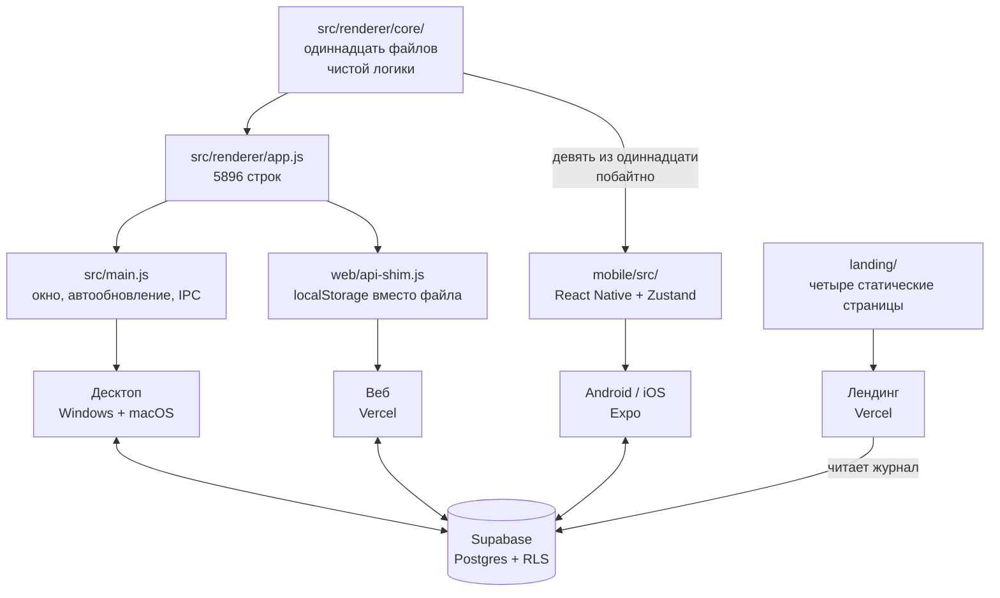
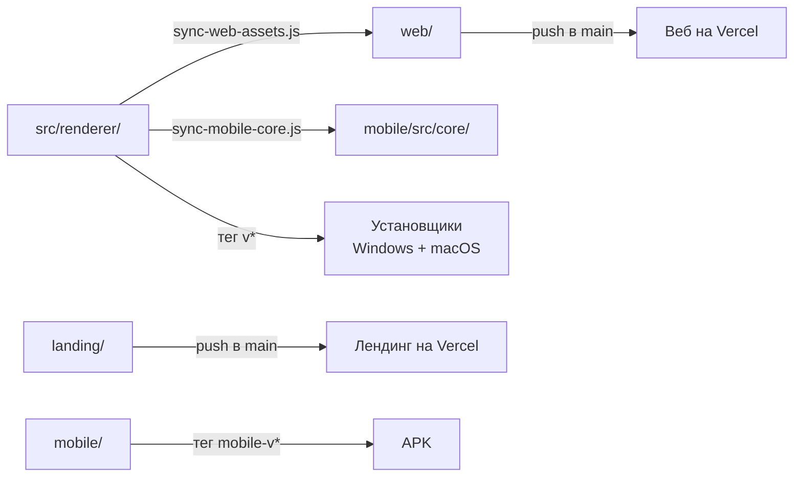

# Как устроен Lancible

Одна модель данных на четыре поверхности: десктоп, веб, телефон и лендинг.
Документ описывает, что где лежит, что между поверхностями общее, а что
продублировано — и чем за это приходится платить. Последний раздел — список
того, что нужно сделать; он часть этого файла намеренно, потому что каждый
пункт там вытекает из устройства, описанного выше.

Числа в документе — замеры на 4 октября 2026 года, а не оценки на глаз.
Длина функции считается по балансу фигурных скобок, а не «от объявления до
следующего объявления»: второй способ приписывает функции все комментарии и
код между ними и завышает всё вдвое. Так уже вышло однажды — fmtWhen значился
здесь как 48 строк, хотя их пять.

То же самое с картинками опубликовано на `lancible.vercel.app/architecture`
(`landing/architecture.html`). Страница служебная: ссылок на неё с сайта нет,
от поисковиков она закрыта, открыть по адресу может кто угодно — ровно как
журнал работы. Числа там те же, что здесь: правишь одно — правь и второе.

## Четыре поверхности



Десктоп и веб делят **один и тот же** `app.js`: у браузера есть DOM, и код
переиспользован почти буквально. Отличает их только шим — третья реализация
контракта `window.api`. Телефон делит с ними лишь часть ядра: DOM там нет,
и обёртку пришлось писать заново.

## Данные

Состояние плоское, живёт целиком в памяти и сохраняется одним куском.

```js
{
  projects: [], tasks: [], statuses: [], tags: [], versions: [],
  activeTimer: null,
  ui:       { view, projectId, navCollapsed },
  settings: { hourlyRate, currency, theme, lang, syncEnabled, syncResolvedFor },
}
```

Кому что принадлежит — не мелочь, на этом уже обжигались:

| Сущность    | Чья                  | Почему так                                             |
|-------------|----------------------|--------------------------------------------------------|
| `projects`  | пользователя         | —                                                       |
| `tasks`     | проекта              | у задачи всегда есть `projectId`                        |
| `statuses`  | **проекта**          | раньше были общими; миграция развела их по проектам     |
| `versions`  | **проекта**          | версия принадлежит продукту, а не всему аккаунту        |
| `tags`      | **общие**            | заводятся в настройках и видны везде                    |
| `sessions`  | задачи               | отрезок времени со своей ставкой на момент записи       |

Ставка запоминается в самой записи времени, а не берётся из текущих настроек:
иначе смена ставки задним числом переписала бы весь заработок за историю.

### В базе

Шесть таблиц в `supabase/schema.sql`: `profiles`, `projects`, `tasks`,
`sessions`, `user_settings`, `sync_state`. Своего сервера у проекта нет, ключ
`anon` открыт, и от чужих данных отделяют только политики RLS — по одной на
таблицу, все вида «own ...». Поэтому права доступа закрыты отдельным слоем
тестов, см. ниже.

Журнал работы (`logs.sql`) лежит там же, но отдельно: писать в него может
только служебный ключ, а читать — кто угодно, иначе страница `/logs` на
лендинге ничего бы не показала.

## Общее ядро и где оно кончается

В `src/renderer/core/` одиннадцать файлов чистой логики без единого
обращения к DOM. На телефон `scripts/sync-mobile-core.js` копирует **девять**
из них побайтно, а `tests/unit/mobile-core.test.js` следит, чтобы копии не
разошлись с оригиналом.

Своими у телефона остались два — словарь и миграция. Вот что где:

| Область    | Десктоп и веб            | Телефон                      | Сверяется тестом |
|------------|--------------------------|------------------------------|------------------|
| `agenda`   | `core/agenda.js`         | побайтная копия              | да               |
| `repeat`   | `core/repeat.js`         | побайтная копия              | да               |
| `status`   | `core/status.js`         | побайтная копия              | да               |
| `versions` | `core/versions.js`       | побайтная копия              | да               |
| `money`    | `core/money.js`          | побайтная копия              | да               |
| `format`   | `core/format.js`         | побайтная копия + локали     | да               |
| `tags`     | `core/tags.js`           | побайтная копия + свои цвета | да               |
| `sync`     | `core/sync.js`           | побайтная копия              | да               |
| отчёты     | `core/reports.js`        | побайтная копия + обёртка    | да               |
| `i18n`     | `core/i18n.js`           | свой словарь, строки короче  | частично         |
| `migrate`  | `core/migrate.js`        | своя реализация              | частично         |

Словарь и миграция остаются своими по делу: на телефоне строки короче, а
миграция знает про поля, которых на десктопе нет. Их сверяют тесты — что
взятое у десктопа взято дословно.

Остальное телефон берёт из побайтных копий, а сверху кладёт тонкий слой:
подставить язык, локаль и «сейчас» там, где ядро принимает их параметром.
`tests/unit/mobile-parity.test.js` проверяет не «работает так же», а «это
те же самые функции» — сравнивает объекты. Проверка поведения пропустила бы
заново написанную копию.

Там же стоит сторож на разрастание: если у телефона появится функция с
именем из ядра, которой нет ни в списке взятых, ни в списке обёрток, тест
упадёт. Иначе новая копия завелась бы молча — именно так и вышло с
отчётами.

Отдельный случай — выгрузка в Excel. Генератор `.xlsx` (`src/xlsx.js`)
переписан на `Uint8Array`/`DataView` без `Buffer` и `zlib`, поэтому работает
и в браузере, и под Hermes без единой правки — его телефон берёт как есть.
Построители листов до недавнего времени существовали дважды и успели
разойтись; теперь их форма — строки, колонки, формулы и итоги — лежит в
`core/reports.js`, а подписи и форматирование приходят параметрами через
`makeReports()`, потому что словарь и `format` у платформ всё ещё свои.
Это и есть образец, по которому стоит закрывать остальные строки таблицы:
общее — в ядро, различия — параметром.

## Сборка и выкат



| Что          | Чем запускается      | Когда                            |
|--------------|----------------------|----------------------------------|
| Веб          | push в `main`        | автоматически                     |
| Лендинг      | push в `main`        | автоматически                     |
| Установщики  | тег `v*`             | GitHub Actions, macOS-раннер обязателен |
| APK          | тег `mobile-v*`      | GitHub Actions                    |

Отсюда правило из `CLAUDE.md`: пуш в `main` — это выкат, поэтому без прямой
команды он не делается.

`web/index.html` написан руками, а стили тянет общие с десктопом. Сборка
копирует в `web/` только `app.js`, `styles.css`, `xlsx.js`, файлы `core/` и
шрифты — разметку не трогает. Поэтому после правки `src/renderer/index.html`
её нужно переносить в `web/index.html` следом, и об этом легко забыть.

## Проверка

Три слоя, у каждого своя работа.

| Слой       | Что проверяет                       | Чем                     |
|------------|-------------------------------------|-------------------------|
| `tests/unit/`    | чистую логику из `core/`      | тест-раннер Node, доли секунды |
| `tests/e2e/`     | собранный `web/` в браузере   | Playwright              |
| `tests/backend/` | политики доступа к базе       | заведомо нарушающая внешний ключ строка: `42501` — политика сработала, `23503` — пропустила |

Быстрые гоняет крюк перед каждым коммитом, все — GitHub Actions на каждый push
и pull request. Известные недоработки помечены `{ todo: ... }` и
`test.fail(...)`: такой тест виден в отчёте, но не красит сборку.

Сверх этого есть граф кода: `graphify-out/` строится локально командой
`graphify update .` и в git не попадает (3,9 МБ производных данных). Он даёт
`graphify query`, `path`, `explain` и две картинки — `graph.html` и
`GRAPH_TREE.html`.

## Что необходимо сделать

По убыванию отношения «польза к риску». Числа — замеры, а не ощущения.

### 1. Распилить `app.js`

5896 строк, но это число само по себе мало что говорит. Из них 523 пустых и
675 комментариев — пятая часть файла, и это стиль проекта, а не долг.

Именованных функций верхнего уровня 254. DOM не трогают 92 из них (872
строки), но «не трогает DOM» — ещё не «чистая»: сеть, хранилище и тосты его
тоже не трогают, а в ядре им места нет. Если отделить и их, **остаётся 67
функций на 559 строк** — вот это и есть настоящие кандидаты в `core/`.
Остальные 25 (313 строк) завязаны на сеть и хранилище.

Главное, что из этого следует: **большой выигрыш от распила уже взят.**
Самая длинная из оставшихся чистых функций — 22 строки, и дальше идут
россыпью по 14–19. Это уже не рычаг, а уборка. Настоящая тяжесть теперь в
отрисовке: `taskItem` (85), `renderAgendaTime` (78), `setupEditor` (73),
`renderAgendaMonth` (72) — но это другая работа, не «вынести в ядро», а
разделить саму отрисовку, и браться за неё стоит под конкретную задачу, а
не ради чистоты.

Первый кусок — отчёты для Excel — вынесен: 181 строка в `app.js` ужалась до
40, дублирование с телефоном исчезло, и появились первые 20 тестов на этот
код. Дальше по убыванию выгоды:

1. **`fmtWhen`** (5 строк) — на телефоне лежит своя версия. Вынести стоит
   не ради размера, а потому что это снова два правила вместо одного.
   Мешает то, что `core/format.js` телефон не берёт вовсе; придётся решать
   это вместе с пунктом 2.
2. **Россыпь мелких** — `cellsForScope` (22), `notificationFeed` (19),
   `repeatGhosts` (18), `applySessionEdit` (17). Каждая сама по себе
   выигрыша не даёт; имеет смысл выносить их по дороге, когда всё равно
   правишь это место.

Самые тяжёлые куски с DOM — `taskItem` (85), `renderAgendaTime` (78),
`setupEditor` (73), `renderAgendaMonth` (72), `renderCalendar` (70). Их
трогать в последнюю очередь.


### 2. Время в выгрузке приведено к ядру

Теги закрыты по-максимуму: восемь функций оказались дословной копией ядра,
и телефон теперь берёт их оттуда — осталось только своё, расчёт цветов
бейджа, которому на десктопе места нет (там есть `color-mix`).

С `format` и `money` так не выйдет сразу: мобильный `format.js` — это ещё и
деньги, и подписи вроде «сегодня», то есть не тот же модуль, а надмножество.
Пока на них стоит сверка, и известное расхождение одно: у ядра «сейчас» —
параметр (`taskElapsedMs(task, timer, now)`, `earnedOf(task, rate, timer,
now)`), а телефон зовёт `Date.now()` внутри и потому непроверяем в заданный
момент. Привести подписи к ядру — первый шаг; дальше чистую часть можно
выносить так же, как отчёты.

### 3. Решить, каким должно быть время в выгрузке

`fmtTime` называется одинаково на обеих платформах, но значит разное: ядро
отдаёт `ЧЧ:ММ:СС` без локали, телефон — локальное `ЧЧ:ММ`. Мобильная версия
писалась для экрана, а потом была переиспользована в отчётах, и построители
листов зовут именно её.

Следствие видно в выгрузке: один и тот же отчёт, скачанный с десктопа и с
телефона, содержит «14:30:05» и «14:30». Это не поломка, но и не решение —
никто этого не выбирал. Различие закреплено тестом, чтобы оно перестало быть
невидимым; какой формат правильный, решать пользователю.

### 3. Вычистить мёртвое

В словаре телефона около девяноста ключей без прямых обращений — часть из них
собирается динамически (`status.default_${kind}`, `repeat.desc_${unit}`), так
что список нужно просеивать, а не удалять скопом. Граф показывает узлы без
входящих рёбер — это второй источник кандидатов.

### Уже сделано

- **Часы в браузерных тестах прибиты.** `agenda.spec` «неделя: семь столбцов»
  и `repeat.spec` «призраки» падали каждое воскресенье: неделя начинается с
  понедельника, и в последний её день срок «на завтра» уезжал в следующую.
  `tests/e2e/clock.js` прибивает время страницы к среде, 10 июня, полудню —
  до `page.goto`, иначе приложение успевает прочитать настоящее.
- **Отчёты сведены в ядро** — см. выше.
- **Решение синхронизации при входе вынесено в ядро** (`planSignInSync`).
  Пять случаев: сервер пуст — залить своё; местного нет — взять серверное;
  данные с обеих сторон и расхождение не разрешено — спросить, и никогда не
  решать самим. Это единственное место в проекте, где ошибка ветки стоит
  пользователю его данных, поэтому разобраны все восемь сочетаний условий.
  Запросы, подписка и диалог остались у платформ: их общими не сделать.
- **Правило галочки «выполнено» вынесено в ядро** (`planTaskDone`). Решение
  отделено от применения: ядро говорит, менять статус или только флаг, а
  стороны применяют это как им удобно.
- **Перекат повторяющейся задачи вынесен в ядро** (`planRepeatRoll`). Две
  реализации успели разойтись по четырём местам, и одно из них было живой
  ошибкой: телефон сравнивал `from` с несуществующим `completion`, то есть
  отсчёт «от дня закрытия» там не работал вовсе.
- **Теги сведены в ядро.** Восемь функций в `mobile/src/lib/tags.js` были
  дословной копией `core/tags.js`; теперь это побайтная копия ядра плюс
  расчёт цветов бейджа. Тест проверяет не «работает так же», а «это те же
  самые функции».
- **`format` и `money` закрыты сверкой.** `tests/unit/mobile-parity.test.js`
  гоняет обе реализации на одних входах по всем четырём языкам — заодно
  сверяется таблица единиц времени, которая лежит в обоих файлах отдельно.
- **Локальный сор убран**: `scripts/preview-*.png`, `_check.xlsx`,
  `_smoke-export-*.xlsx`, `test-results/`. Всё пересоздаётся.

### Хвосты инструментов

- Хуки graphify в `.claude/settings.json` зовут `graphify` по имени. Каталог
  `~/.local/bin` добавлен в `PATH` пользователя, но процессы, запущенные
  раньше, его не видят — работать хуки начнут со следующего запуска
  приложения.
- Плагин ponytail не установлен: правку настроек дважды отклонил
  автоматический режим. Ключи для ручной вставки — в журнале задачи
  `2026-10-04-plugins-ponytail-graphify`.
- `uv` создаёт битые junction-ссылки на каталоги Python; интерпретатор
  приходится указывать полным путём. Это вопрос к `uv`, не к проекту.
