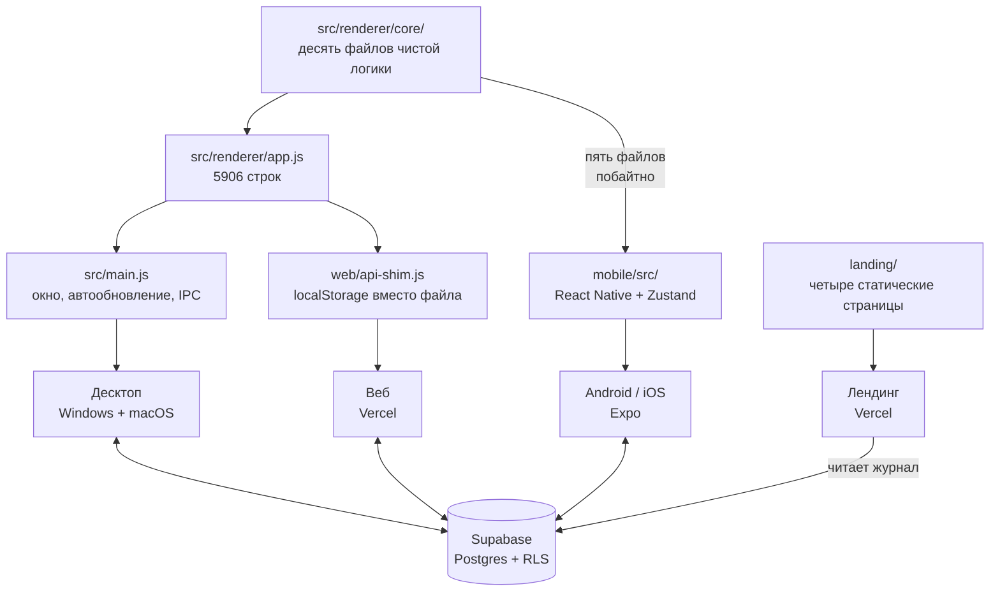
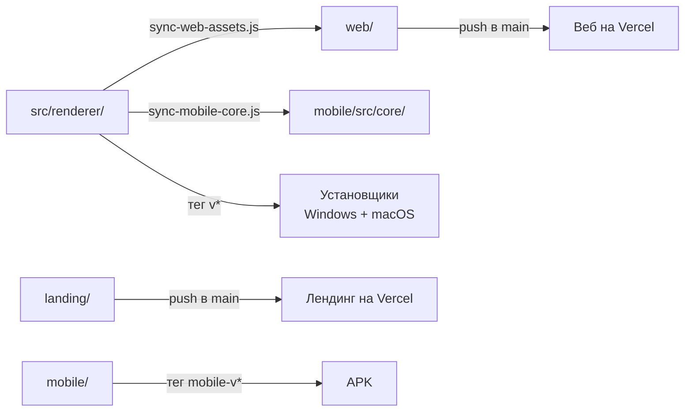

# Как устроен Lancible

Одна модель данных на четыре поверхности: десктоп, веб, телефон и лендинг.
Документ описывает, что где лежит, что между поверхностями общее, а что
продублировано — и чем за это приходится платить. Последний раздел — список
того, что нужно сделать; он часть этого файла намеренно, потому что каждый
пункт там вытекает из устройства, описанного выше.

Числа в документе — замеры на 4 октября 2026 года, а не оценки на глаз.

## Четыре поверхности



Десктоп и веб делят **один и тот же** `app.js`: у браузера есть DOM, и код
переиспользован почти буквально. Отличает их только шим — третья реализация
контракта `window.api`. Телефон делит с ними лишь часть ядра: DOM там нет,
и обёртку пришлось писать заново.

## Данные

Состояние плоское, живёт целиком в памяти и сохраняется одним куском.

```js
{
  projects: [], tasks: [], statuses: [], tags: [], versions: [],
  activeTimer: null,
  ui:       { view, projectId, navCollapsed },
  settings: { hourlyRate, currency, theme, lang, syncEnabled, syncResolvedFor },
}
```

Кому что принадлежит — не мелочь, на этом уже обжигались:

| Сущность    | Чья                  | Почему так                                             |
|-------------|----------------------|--------------------------------------------------------|
| `projects`  | пользователя         | —                                                       |
| `tasks`     | проекта              | у задачи всегда есть `projectId`                        |
| `statuses`  | **проекта**          | раньше были общими; миграция развела их по проектам     |
| `versions`  | **проекта**          | версия принадлежит продукту, а не всему аккаунту        |
| `tags`      | **общие**            | заводятся в настройках и видны везде                    |
| `sessions`  | задачи               | отрезок времени со своей ставкой на момент записи       |

Ставка запоминается в самой записи времени, а не берётся из текущих настроек:
иначе смена ставки задним числом переписала бы весь заработок за историю.

### В базе

Шесть таблиц в `supabase/schema.sql`: `profiles`, `projects`, `tasks`,
`sessions`, `user_settings`, `sync_state`. Своего сервера у проекта нет, ключ
`anon` открыт, и от чужих данных отделяют только политики RLS — по одной на
таблицу, все вида «own ...». Поэтому права доступа закрыты отдельным слоем
тестов, см. ниже.

Журнал работы (`logs.sql`) лежит там же, но отдельно: писать в него может
только служебный ключ, а читать — кто угодно, иначе страница `/logs` на
лендинге ничего бы не показала.

## Общее ядро и где оно кончается

В `src/renderer/core/` десять файлов чистой логики без единого обращения к
DOM. На телефон `scripts/sync-mobile-core.js` копирует **пять** из них
побайтно, а `tests/unit/mobile-core.test.js` следит, чтобы копии не разошлись
с оригиналом.

Остальные пять телефон реализует заново. Это и есть главный шов в проекте:

| Область    | Десктоп и веб            | Телефон                      | Сверяется тестом |
|------------|--------------------------|------------------------------|------------------|
| `agenda`   | `core/agenda.js`         | побайтная копия              | да               |
| `repeat`   | `core/repeat.js`         | побайтная копия              | да               |
| `status`   | `core/status.js`         | побайтная копия              | да               |
| `versions` | `core/versions.js`       | побайтная копия              | да               |
| отчёты     | `core/reports.js`        | побайтная копия + обёртка    | да               |
| `i18n`     | `core/i18n.js`           | свой словарь, строки короче  | частично         |
| `migrate`  | `core/migrate.js`        | своя реализация              | частично         |
| `format`   | `core/format.js`         | своя реализация              | **нет**          |
| `money`    | `core/money.js`          | своя реализация              | **нет**          |
| `tags`     | `core/tags.js`           | своя реализация              | **нет**          |

Где написано «нет» — две независимые реализации одного правила, которые
разойдутся молча. У словаря и миграции хотя бы есть тесты, проверяющие, что
взятое у десктопа взято дословно.

Отдельный случай — выгрузка в Excel. Генератор `.xlsx` (`src/xlsx.js`)
переписан на `Uint8Array`/`DataView` без `Buffer` и `zlib`, поэтому работает
и в браузере, и под Hermes без единой правки — его телефон берёт как есть.
Построители листов до недавнего времени существовали дважды и успели
разойтись; теперь их форма — строки, колонки, формулы и итоги — лежит в
`core/reports.js`, а подписи и форматирование приходят параметрами через
`makeReports()`, потому что словарь и `format` у платформ всё ещё свои.
Это и есть образец, по которому стоит закрывать остальные строки таблицы:
общее — в ядро, различия — параметром.

## Сборка и выкат



| Что          | Чем запускается      | Когда                            |
|--------------|----------------------|----------------------------------|
| Веб          | push в `main`        | автоматически                     |
| Лендинг      | push в `main`        | автоматически                     |
| Установщики  | тег `v*`             | GitHub Actions, macOS-раннер обязателен |
| APK          | тег `mobile-v*`      | GitHub Actions                    |

Отсюда правило из `CLAUDE.md`: пуш в `main` — это выкат, поэтому без прямой
команды он не делается.

`web/index.html` написан руками, а стили тянет общие с десктопом. Сборка
копирует в `web/` только `app.js`, `styles.css`, `xlsx.js`, файлы `core/` и
шрифты — разметку не трогает. Поэтому после правки `src/renderer/index.html`
её нужно переносить в `web/index.html` следом, и об этом легко забыть.

## Проверка

Три слоя, у каждого своя работа.

| Слой       | Что проверяет                       | Чем                     |
|------------|-------------------------------------|-------------------------|
| `tests/unit/`    | чистую логику из `core/`      | тест-раннер Node, доли секунды |
| `tests/e2e/`     | собранный `web/` в браузере   | Playwright              |
| `tests/backend/` | политики доступа к базе       | заведомо нарушающая внешний ключ строка: `42501` — политика сработала, `23503` — пропустила |

Быстрые гоняет крюк перед каждым коммитом, все — GitHub Actions на каждый push
и pull request. Известные недоработки помечены `{ todo: ... }` и
`test.fail(...)`: такой тест виден в отчёте, но не красит сборку.

Сверх этого есть граф кода: `graphify-out/` строится локально командой
`graphify update .` и в git не попадает (3,9 МБ производных данных). Он даёт
`graphify query`, `path`, `explain` и две картинки — `graph.html` и
`GRAPH_TREE.html`.

## Что необходимо сделать

По убыванию отношения «польза к риску». Числа — замеры, а не ощущения.

### 1. Распилить `app.js`

5906 строк, 257 функций верхнего уровня. Из них **83 функции (1068 строк) не
трогают DOM вовсе** — это готовые кандидаты в `core/`, и к ним сразу можно
писать юнит-тесты. Оставшиеся 174 функции (4737 строк) мешают расчёт с
отрисовкой.

Первый кусок — отчёты для Excel — вынесен: 181 строка в `app.js` ужалась до
40, дублирование с телефоном исчезло, и появились первые 20 тестов на этот
код. Дальше по убыванию выгоды:

1. **`rollRepeat`** (53 строки) — логика переката повторяющейся задачи. Рядом
   уже лежит `core/repeat.js`, место очевидное.
2. **`fmtWhen`** (48 строк) — форматирование даты, место в `core/format.js`.
3. **Синхронизация** — `pushSyncState`, `syncOnSignInInner`, `afterSignedIn`
   (~86 строк) чистые, но завязаны на глобальный `state`; потребуют
   параметризации.
4. **`setTaskDone`** (25 строк) — на телефоне уже лежит точный порт этой
   функции, то есть снова две реализации одного правила.

Самые тяжёлые куски с DOM — `applyStaticTranslations` (197 строк),
`applyRemind` (142), `recoverActiveTimer` (125), `renderRepeatDialog` (115).
Их трогать в последнюю очередь.

### 2. Закрыть расхождение между десктопом и телефоном

`format`, `money` и `tags` живут в двух реализациях без единого теста, который
бы их сверял. Минимум — завести перекрёстные тесты по образцу
`mobile-i18n.test.js` («то, что взято у десктопа, взято дословно»). Максимум —
поступить как с отчётами: общее в ядро, различия параметром, и добавить файл
в список `scripts/sync-mobile-core.js`.

### 3. Вычистить мёртвое

В словаре телефона около девяноста ключей без прямых обращений — часть из них
собирается динамически (`status.default_${kind}`, `repeat.desc_${unit}`), так
что список нужно просеивать, а не удалять скопом. Граф показывает узлы без
входящих рёбер — это второй источник кандидатов.

### Уже сделано

- **Часы в браузерных тестах прибиты.** `agenda.spec` «неделя: семь столбцов»
  и `repeat.spec` «призраки» падали каждое воскресенье: неделя начинается с
  понедельника, и в последний её день срок «на завтра» уезжал в следующую.
  `tests/e2e/clock.js` прибивает время страницы к среде, 10 июня, полудню —
  до `page.goto`, иначе приложение успевает прочитать настоящее.
- **Отчёты сведены в ядро** — см. выше.
- **Локальный сор убран**: `scripts/preview-*.png`, `_check.xlsx`,
  `_smoke-export-*.xlsx`, `test-results/`. Всё пересоздаётся.

### Хвосты инструментов

- Хуки graphify в `.claude/settings.json` зовут `graphify` по имени. Каталог
  `~/.local/bin` добавлен в `PATH` пользователя, но процессы, запущенные
  раньше, его не видят — работать хуки начнут со следующего запуска
  приложения.
- Плагин ponytail не установлен: правку настроек дважды отклонил
  автоматический режим. Ключи для ручной вставки — в журнале задачи
  `2026-10-04-plugins-ponytail-graphify`.
- `uv` создаёт битые junction-ссылки на каталоги Python; интерпретатор
  приходится указывать полным путём. Это вопрос к `uv`, не к проекту.
